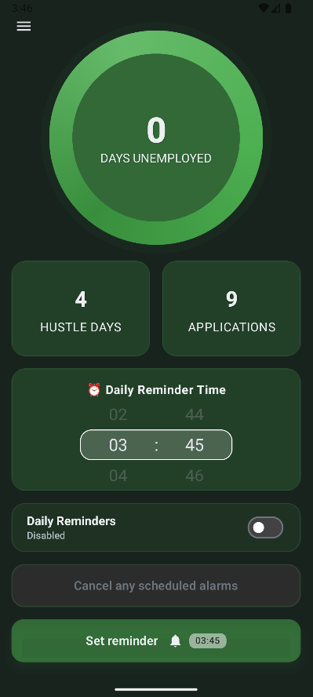
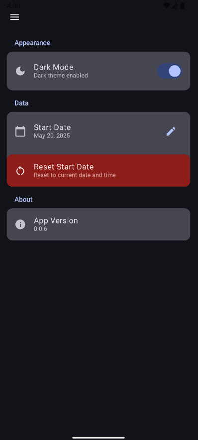
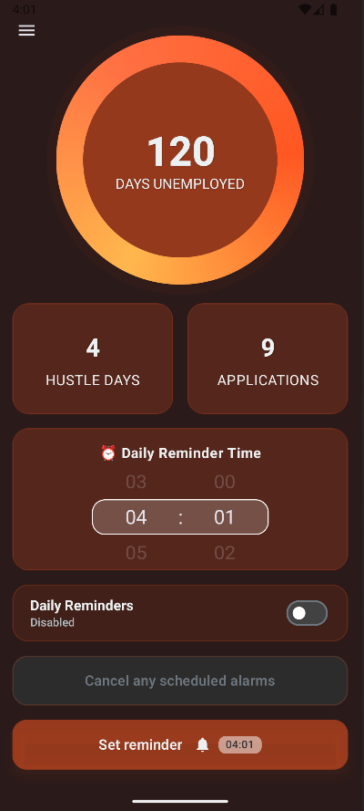
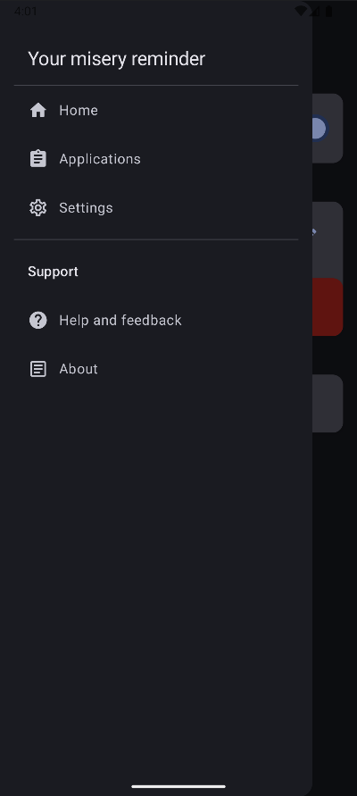
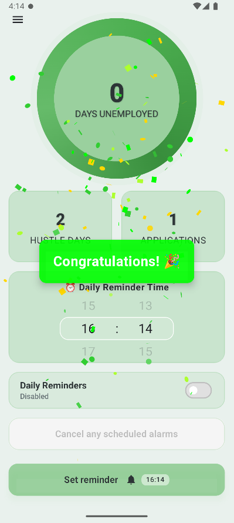

# Misery Reminder  

**Misery Reminder** is a simple yet motivating Android application designed to keep users focused on their career goals.  

The app helps by:  
- Sending **regular notifications** to remind users to stay consistent in their job hunt.  
- Tracking how many **days they’ve been hustling** and how many **jobs they’ve applied for**.  
- Providing a **company log screen** where users can register all the companies they’ve applied to.  
- Displaying a **counter for unemployed days** — the counter’s color gradually shifts to more alarming tones the longer the user remains unemployed.  

## ✨ Features
- 🔔 **Notifications** – Regular reminders that can be canceled at any time.  
- 📅 **Unemployed Days Counter** – Starts counting from the moment the app is installed, with the option to reset or adjust from settings.  
- 🏢 **Company Applications Tracker** – Keep a record of every job application.  
- 🎨 **Dynamic Color Feedback** – Visual indication of urgency as unemployed days increase.  

## 💡 Motivation
This app is built as a **productivity and accountability tool**, designed to motivate job seekers by turning their job search into a trackable journey.  
## 📱 Screenshots

| Main Screen | Applications Log | Settings |
|-------------|------------------|----------|
|  |  |  |

| Dynamic Color Warning | Routes | Confetti |
|----------------------|---------|----------|
|  |  | 

## 🤝 Contributing & Feedback

Have ideas for improvements? Found a bug? Want to contribute code? 

**Message me** for any improvement ideas or suggestions! I'm always looking to make this app more useful for job seekers.

📞 **Contact me:**
- 
- 

### You can also:
- Open an issue for bug reports
- Submit pull requests for code improvements
- Share feature requests
